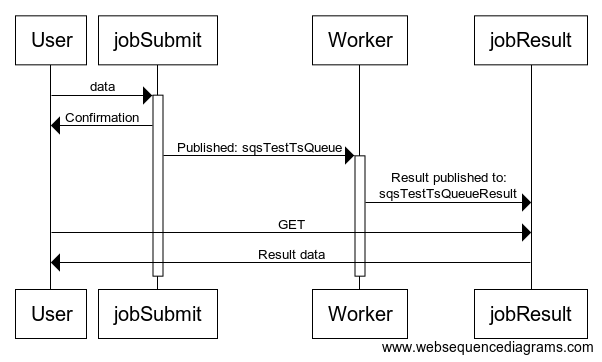

# sqs-test-ts
Testing launching a Lambda from AWS SQS and a naive Request-Response Messaging Pattern implementation.

## NOTE
  This is not production code, it doesn't work with concurrency, there is currently no implementation for SQS Virtual Queues on AWS SDK JS. Check **Request-Response Messaging Pattern (Virtual Queues)**

## Diagram 


1. User sends a request to `jobSubmit` 
2. It then published to `sqsTestTsQueue`
3. Worker listen to `sqsTestTsQueue` and process the job
4. Then publishing results to `sqsTestTsQueueResult`
5. User can periodically check for results using `jobResult` endpoint, which checks `sqsTestTsQueueResult` for results.

## Create project from template

```shell
sls create \
  --template aws-nodejs-typescript \
  --path sqs-test-ts \
  --name sqs-test-ts

# Development packages
serverless plugin install --name serverless-iam-roles-per-function
serverless plugin install --name serverless-offline
serverless plugin install --name serverless-prune-plugin

npm i -D \
  @types/aws-lambda \
  @types/node

# Production packages
npm i \
  aws-sdk \
  aws-lambda
```

## Submit new Job

```shell
# Send Message
curl -XPOST -d@data/send-message.json \
 https://5lusfu0ct5.execute-api.us-east-1.amazonaws.com/dev/sqs/jobSubmit

# Check for Response
curl https://5lusfu0ct5.execute-api.us-east-1.amazonaws.com/dev/sqs/jobResult
```

# References

* [Simple SQS Standard Typescript Example](https://github.com/serverless/examples/tree/master/aws-node-typescript-sqs-standard)
* [Request-Response Messaging Pattern (Virtual Queues)](https://docs.aws.amazon.com/AWSSimpleQueueService/latest/SQSDeveloperGuide/sqs-temporary-queues.html#request-reply-messaging-pattern)